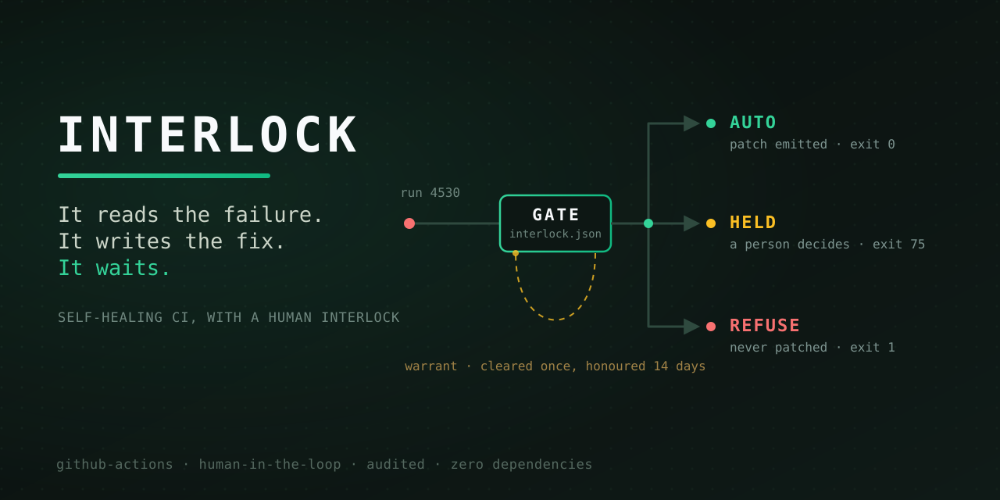

<p align="center">
  
</p>

<h1 align="center">Interlock</h1>

<p align="center"><strong>Self-healing CI, with a human interlock.<br/>It can fix it. May it?</strong></p>

<p align="center">Created by <a href="https://www.linkedin.com/in/manpreet17/">Manpreet Singh</a></p>

<p align="center">
  <a href="#quickstart">Quickstart</a> ·
  <a href="#the-four-pillars">Pillars</a> ·
  <a href="#the-cli">CLI</a> ·
  <a href="docs/manifesto.md">Manifesto</a> ·
  <a href="docs/adoption.md">Adopt in 30 min</a> ·
  <a href="integrations/langgraph/">LangGraph</a>
</p>

<p align="center">
  
  =18" src="https://img.shields.io/badge/node-%E2%89%A518-blue?style=flat-square">
  
  
</p>

---

An agent that can fix your broken pipeline can also break it. Interlock is the
file that decides which.

```
CODEOWNERS      →  who must review a pull request       (you already have this)
interlock.json  →  what may become one, and by whom     (this is Interlock)
```

Branch protection guards the merge. Nothing guards the moment a machine decided
something was worth changing.

## Who it acts like

Everyone has worked with him. He isn't against automation. He's against the
*specific* automation that took prod down one Friday in 2019, and he has not
forgotten which file it edited.

Show him a missing dependency pin and he waves it through without looking up.
Show him a patch to the deploy workflow and he doesn't finish reading the diff.

He is not slow. He is fast about exactly the things that are safe to be fast
about, and that list took him a decade to write.

**Interlock is that person, written down.**

## The 2am version

Your agent reads a failed build, concludes the fix is a tweak to the deploy
workflow, and opens a PR. It is well written, it explains itself, and at 2am it
looks plausible enough to merge.

With interlock:

```
REFUSE  .github/workflows/deploy.yml is denied by scope.deny
```

Same agent. Same patch. The difference is that somebody wrote down, in advance
and in a reviewed file, that nothing automatic touches deploys.

## Why

Every existing control acts on a pull request that already exists. That is right
for a human contributor, who had a reason you can ask about. For an agent that
opened forty PRs this week, "looks plausible" is the entire review.

So teams pick one of two bad answers. **Fully autonomous**, which is fine until
the day a transient network error looks like a config bug. Or **fully manual**,
which means your best engineer spends an afternoon discovering a one-line fix.

Interlock is the third answer: write the authority down, enforce it, record it.
Full argument in [the manifesto](docs/manifesto.md).

## Quickstart

```bash
npx github:manpreet171/interlock init
```

```
✔ wrote interlock.json   ← review this in a PR like any other code
✔ created .interlock/      ← the ledger lands here. Commit it.
```

Point it at a build that actually broke:

```bash
gh run view 4471 --log-failed > run.log
interlock gate run.log --repo acme/api --run 4471
```

```
missing-python-module  263819a52f2e
  A Python import is not in the dependency file
  evidence  ModuleNotFoundError: No module named 'requests'
  proposal  add "requests" to requirements.txt
  touches   requirements.txt

  AUTO  class "missing-python-module" is pre-cleared and the change is in scope

--- a/requirements.txt
+++ b/requirements.txt
@@ -1,3 +1,4 @@
 flask==3.0.0
 gunicorn==21.2.0
 pytest==8.0.0
+requests
```

Exit 0, patch on stdout, pipe it into `git apply`. Now a failure the policy does
**not** pre-clear:

```
  HOLD  class "set-output-deprecated" needs clearance

  held as h-627fdffd  →  interlock clear h-627fdffd   or   interlock reject h-627fdffd
```

Exit **75** — waiting on a person, not failed. Somebody looks at it:

```bash
interlock clear h-627fdffd --by "Manpreet Singh" --reason "outputs identical, checked both steps"
```

```
✔ cleared h-627fdffd  by Manpreet Singh
  warrant covers fingerprint 1c59f09f5474 for 14 days
  valid only while rules 640490871853 are unchanged
```

Three days later the same build breaks the same way — new run id, new
timestamps, new runner path:

```
  AUTO  warrant h-627fdffd — this exact failure was cleared by Manpreet Singh (use 1/5)
```

**It does not ask again.** That is the whole product. A different failure still
does, and always will.

Both of these run from a clean clone with no setup — see
[`examples/`](examples/).

## The thing you cannot fake

A failure gets a **fingerprint**: a hash of its class plus its evidence, after
timestamps, run ids, runner paths, commit hashes and line numbers are stripped
out. The same break always hashes the same. Different breaks never collide.

That is what makes an approval *specific*. Without it, the only permissions you
can express are "yes, this once" and "yes, forever" — and what people actually
want is **"yes, to this."** Because the fingerprint comes from the log, the thing
asking for permission cannot forge it.

Each clearance is also stamped with a **rules hash** covering the enforcing parts
of your policy. Loosen `scope.allow` and every past clearance dies with it:

```
$ interlock log --verify
4 entries  ·  rules in force now: 87d0bb038798
! 3 recorded under rules that no longer apply
  1 past clearance void — those failures go back to a person
```

A permission granted under one set of rules does not silently survive into
another.

## The four pillars

| Pillar | The question it answers |
| ------ | ----------------------- |
| **Scope** | Which files may a fix touch? |
| **Signature** | What broke, named the same way every time? |
| **Clearance** | Who says yes — and does a past yes still count? |
| **Record** | What happened, written where it can be checked? |

Depth, and the part most people skip for each: [`docs/pillars.md`](docs/pillars.md).

## The whole decision, in order

Seven questions. **Stop at the first one that answers.**

```
1. Is this failure class on the refuse list?      REFUSE   not by anyone, ever
2. Does the patch touch a denied file?            REFUSE   scope beats class
3. Does it touch a file that is not allowed?      REFUSE   silence is not permission
4. Is there no deterministic fix for this?        HOLD     a person writes this one
5. Is the patch bigger than you said it would be? HOLD     size is a smell test
6. Is the class pre-cleared in the policy?        AUTO     decided in advance, in a PR
7. Did a person clear this exact failure before?  AUTO     the warrant still stands

   nothing answered?                              HOLD     the default is ask
```

Two properties fall out of the order, and both are deliberate. **Scope outranks
class** — a pre-cleared failure is still refused if its fix lands somewhere it
may not. And **a warrant is consulted last**, so it can only turn a hold into an
auto. It can never rescue a refuse.

In `strict` mode, rungs 6 and 7 are switched off: everything that is not a
refuse becomes a hold.

## What it will never do

He isn't against automation — he's against the specific automation that took
prod down. A safety tool that quietly relaxes is worse than none, because you
stop watching it. So interlock:

- **never widens its own scope** — scope is read off the diff it built, not off
  anything the agent claims about itself
- **never guesses a version number** — a deprecated action gets reported, not
  bumped on a hunch
- **never writes a secret** — missing credentials are a person walking to a
  settings page
- **never carries a clearance across a rule change**
- **never turns a red test green** — a failing test is the pipeline working

## The CLI

| Command | What it does |
| ------- | ------------ |
| `interlock init` | Write `interlock.json` and the ledger folder. |
| `interlock lint` | Check the policy. Exit 1 on failure — CI-friendly. |
| `interlock diagnose <log>` | Classify a log and propose a fix. No policy, no side effects. |
| `interlock gate <log>` | Diagnose, then apply the policy. Exit 0 / 75 / 1. |
| `interlock clear <id>` | Approve a held fix and issue a warrant. Refuses without `--by`. |
| `interlock reject <id>` | Refuse a held fix. It will stop again next time. |
| `interlock log [--verify]` | The record — and whether it still holds today. |

Useful flags: `--json` for machines, `--slack` for a Block Kit payload with the
diff and two buttons, `--quiet` to pipe a cleared patch straight into `git apply`.

### An intensity dial, not all-or-nothing

| Mode | Behaviour |
| ---- | --------- |
| `shadow` | Records every verdict, blocks nothing. **Start here for a week.** |
| `normal` | Enforces the policy. Warrants are honoured. |
| `strict` | Every patch gets a person. Warrants ignored. Good during an incident. |
| `off` | Passes everything through. |

## What's in the box

```
interlock.json              # ★ the policy — reviewed in a PR like any other code
bin/interlock.mjs           #   the whole CLI, one file, zero dependencies
AGENT-RULES.md              #   zero-setup fallback: the same rules in prose
schema/                     #   JSON Schema for the policy and the ledger
examples/                   #   two real failures, end to end, runnable now
  missing-module/           #     pre-cleared → patch, exit 0
  deprecated-set-output/    #     held → cleared → never asked again
integrations/langgraph/     #   a LangGraph agent that asks interlock what it may do
docs/                       #   manifesto · pillars · adoption
test/run.mjs                #   35 tests, no framework
```

## Works with what you already use

Interlock is **deliberately not a framework**. No service, no database, no
account, no runtime dependencies. It reads a log file and writes a JSON line.

- **GitHub Actions** — one `if: failure()` step. Exit codes distinguish held
  from broken. See [adoption](docs/adoption.md).
- **Slack** — `--slack` prints the Block Kit payload; pipe it to `curl`. No app
  to install.
- **LangGraph** — the [reference agent](integrations/langgraph/) uses
  `interrupt()` for the pause and interlock for the authority.
- **Any agent at all** — `--json` in, verdict out. Or skip the CLI entirely and
  copy [`AGENT-RULES.md`](AGENT-RULES.md) into your repo.

## Does it work?

The mechanism is tested: 35 tests cover fingerprint stability, patches surviving
`git apply`, scope denial, warrant expiry and reuse limits, rule-change
invalidation, and every exit code.

```
$ node test/run.mjs
35 passed
```

**Not measured yet:** how much engineering time this saves in a real
organisation. That needs a team running it for a quarter, and publishing a
number before then would be making one up. The
[before/after](#the-2am-version) is the honest case today.

## FAQ

**Is this a replacement for branch protection?**
No — it is the layer above. Branch protection governs the merge; interlock
governs whether a change should have been proposed at all. Keep both. Dependabot
and Renovate are complements too: they propose *known upgrades on a schedule*,
interlock governs *unplanned repairs to a broken pipeline*. Different moments,
no overlap.

**Do I need an LLM?**
No. Fourteen failure classes are matched by rule, three produce a deterministic
patch, and the rest are diagnosed and routed to a person. An LLM is optional and
plugs in at the `unknown` class — and whatever it writes still goes through the
gate.

**Does it apply patches itself?**
No. It prints a diff. Applying it is your pipeline's decision, with your
credentials. A tool that both decides and commits is a tool with no gap in it.

**Why so few automatic fixes?**
Because most CI failures do not have one right answer, and a confidently wrong
patch to a build pipeline costs a team more than a red build does. Interlock
would rather say "I do not know what to do here" than improvise. He has seen a
confident patch before.

**Why "Interlock"?**
In railway signalling, an interlock is the mechanism that makes an unsafe move
physically impossible — you cannot set a route into a track another train is
already on. It does not slow the railway down. It makes going fast survivable.

## Author

**Manpreet Singh**
[LinkedIn](https://www.linkedin.com/in/manpreet17/) ·
[GitHub](https://github.com/manpreet171) ·
[Medium](https://medium.com/@singh.manpreet171900) ·
[singh.manpreet171900@gmail.com](mailto:singh.manpreet171900@gmail.com)

If you put this in front of a real pipeline, I would genuinely like to hear
which failure class you added first and which bucket you put it in. Open an
issue — those are the interesting decisions.

[MIT](LICENSE) © Manpreet Singh
