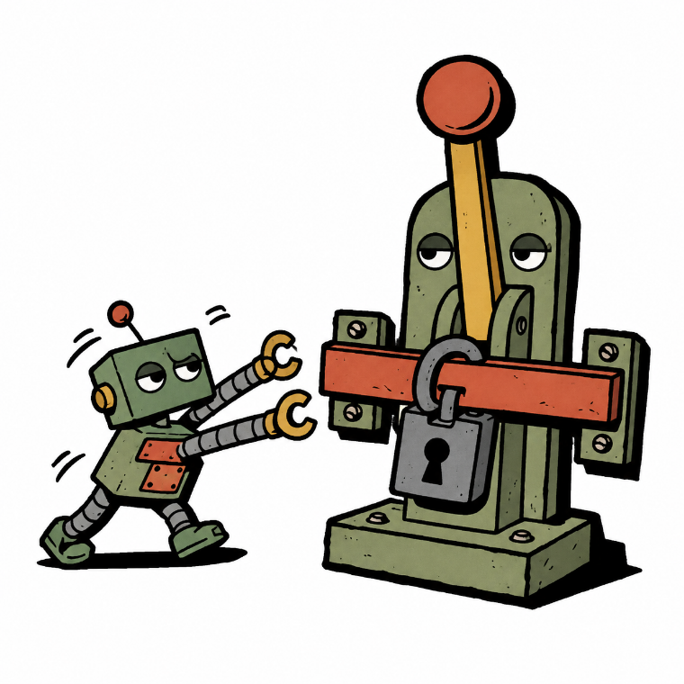
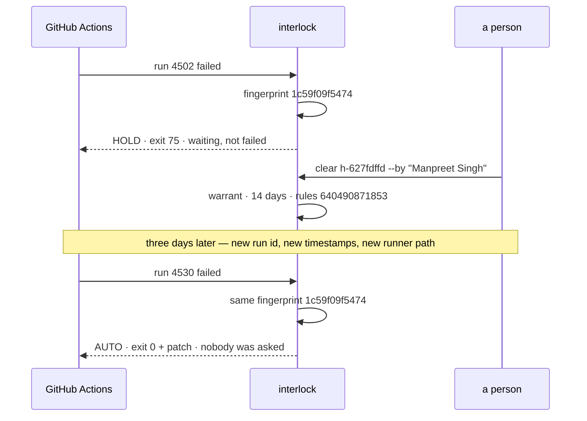

<p align="center">
  
</p>

<h1 align="center">Interlock</h1>

<p align="center"><strong>Self-healing CI, with a human interlock.<br/>It can fix it. May it?</strong></p>

<p align="center">Created by <a href="https://www.linkedin.com/in/manpreet17/">Manpreet Singh</a> · Part of <a href="https://singhlabs.dev/interlock/">Singh Labs</a></p>

<p align="center">
  <a href="#quickstart">Quickstart</a> · <a href="#the-four-pillars">Pillars</a> · <a href="#the-cli">CLI</a> · <a href="integrations/langgraph/">LangGraph</a>
</p>

<p align="center">
     
</p>

---

An agent that can fix your broken pipeline can also break it. Interlock is the
file that decides which.

```
CODEOWNERS      →  who must review a pull request       (you already have this)
interlock.json  →  what may become one, and by whom     (this is Interlock)
```

Branch protection guards the merge. Nothing guards the moment a machine decided
something was worth changing.

## Who it acts like

Everyone has worked with him. He isn't against automation — he's against the
*specific* automation that took prod down one Friday in 2019, and he has not
forgotten which file it edited. Show him a missing dependency pin and he waves it
through without looking up. Show him a patch to the deploy workflow and he
doesn't finish reading the diff.

**Interlock is that person, written down.** So when your agent reads a failed
build at 2am, decides the fix is a tweak to the deploy workflow, and writes it up
beautifully:

```
REFUSE  .github/workflows/deploy.yml is denied by scope.deny
```

Same agent, same patch. The difference is that somebody decided this in advance,
in a reviewed file, while awake.

## Why

Every existing control acts on a pull request that already exists. That is right
for a human contributor, who had a reason you can ask about. For an agent that
opened forty PRs this week, "looks plausible" is the entire review. So teams pick
one of two bad answers: **fully autonomous**, fine until a transient network
error looks like a config bug — or **fully manual**, where your best engineer
spends an afternoon discovering a one-line fix.

Interlock is the third answer: write the authority down, enforce it, record it.

## Quickstart

```bash
npm install -g github:manpreet171/interlock   # installs the `interlock` command
interlock init                                # writes interlock.json
gh run view 4471 --log-failed > run.log       # a build that actually broke
interlock gate run.log --repo acme/api --run 4471
```

Install from the repo, not the bare npm name — `interlock` on npm belongs to an
unrelated package. Prefer not to install globally? Prefix every command with
`npx github:manpreet171/interlock` instead.

```
missing-python-module  263819a52f2e
  A Python import is not in the dependency file
  evidence  ModuleNotFoundError: No module named 'requests'
  proposal  add "requests" to requirements.txt
  touches   requirements.txt

  AUTO  class "missing-python-module" is pre-cleared and the change is in scope

--- a/requirements.txt
+++ b/requirements.txt
@@ -1,3 +1,4 @@
 flask==3.0.0
 gunicorn==21.2.0
 pytest==8.0.0
+requests
```

Exit 0, patch on stdout, pipe it into `git apply`. A failure the policy does
**not** pre-clear stops at exit **75** instead — waiting on a person, not failed:

```
  HOLD  class "set-output-deprecated" needs clearance
  held as h-627fdffd  →  interlock clear h-627fdffd   or   interlock reject h-627fdffd
```

Somebody looks at it once — `--by` is required, so every clearance has a name on
it. Three days later the same build breaks the same way, and nobody is asked:

```
  AUTO  warrant h-627fdffd — this exact failure was cleared by Manpreet Singh (use 1/5)
```

Both paths run from a clean clone — see [`examples/`](examples/).

## The thing you cannot fake



That `1c59f09f5474` is a **fingerprint** — a hash of the failure's evidence once
timestamps, run ids, runner paths, commit hashes and line numbers are stripped
out. It makes an approval *specific*: not "yes, this once", not "yes, forever",
but **"yes, to this"** — and since it comes from the log, the thing asking for
permission cannot forge it. Each clearance also carries a **rules hash**, so
loosening `scope.allow` kills every clearance given under the old rules:

```
$ interlock log --verify
4 entries  ·  rules in force now: 87d0bb038798
! 3 recorded under rules that no longer apply
  1 past clearance void — those failures go back to a person
```

## The four pillars

| Pillar | The question it answers |
| ------ | ----------------------- |
| **Scope** | Which files may a fix touch? |
| **Signature** | What broke, named the same way every time? |
| **Clearance** | Who says yes — and does a past yes still count? |
| **Record** | What happened, written where it can be checked? |

Diagrams, depth, and the part most people skip: [`docs/pillars.md`](docs/pillars.md).

## The whole decision, in order

Seven questions — **stop at the first one that answers.**

```
1. Is this failure class on the refuse list?      REFUSE   not by anyone, ever
2. Does the patch touch a denied file?            REFUSE   scope beats class
3. Does it touch a file that is not allowed?      REFUSE   silence is not permission
4. Is there no deterministic fix for this?        HOLD     a person writes this one
5. Is the patch bigger than you said it would be? HOLD     size is a smell test
6. Is the class pre-cleared in the policy?        AUTO     decided in advance, in a PR
7. Did a person clear this exact failure before?  AUTO     the warrant still stands

   nothing answered?                              HOLD     the default is ask
```

Two properties fall out of the order: **scope outranks class**, so a pre-cleared
failure is refused if its fix lands somewhere it may not — and **a warrant is
consulted last**, so it can only turn a hold into an auto, never rescue a refuse.
`strict` mode switches rungs 6 and 7 off entirely. Drawn out in
[`docs/pillars.md`](docs/pillars.md).

## What it will never do

A safety tool that quietly relaxes is worse than none, because you stop watching
it. So interlock **never widens its own scope** (scope is read off the diff it
built, not off anything the agent claims), **never guesses a version number**
(a deprecated action gets reported, not bumped on a hunch), **never writes a
secret**, **never carries a clearance across a rule change**, and **never turns a
red test green** — a failing test is the pipeline working.

## The CLI

| Command | What it does |
| ------- | ------------ |
| `interlock init` | Write `interlock.json` and the ledger folder. |
| `interlock lint` | Check the policy. Exit 1 on failure — CI-friendly. |
| `interlock diagnose <log>` | Classify a log and propose a fix. No policy, no side effects. |
| `interlock gate <log>` | Diagnose, then apply the policy. Exit 0 / 75 / 1. |
| `interlock clear <id>` | Approve a held fix and issue a warrant. Refuses without `--by`. |
| `interlock reject <id>` | Refuse a held fix. It will stop again next time. |
| `interlock log [--verify]` | The record — and whether it still holds today. |

Flags: `--json` for machines, `--slack` for a Block Kit payload with the diff and
two buttons, `--quiet` to pipe a cleared patch into `git apply`.

**An intensity dial, not all-or-nothing:** `shadow` records every verdict and
blocks nothing — start here for a week · `normal` enforces · `strict` sends every
patch to a person and ignores warrants · `off` passes everything through.

## Works with what you already use

Interlock is **deliberately not a framework**. No service, no database, no
account, no dependencies — `interlock.json` and one `.mjs` file that reads a log
and writes a JSON line.

- **GitHub Actions** — one `if: failure()` step; exit codes distinguish held from
  broken.
- **Slack** — `--slack` prints the payload, pipe it to `curl`. No app to install.
- **LangGraph** — the [reference agent](integrations/langgraph/) uses
  `interrupt()` for the pause and interlock for the authority.
- **Any agent at all** — `--json` in, verdict out. Or skip the CLI entirely and
  copy [`AGENT-RULES.md`](AGENT-RULES.md) into your repo.

## Does it work?

35 tests on Node 18, 20 and 22 cover fingerprint stability, patches surviving
`git apply`, scope denial, warrant expiry and reuse limits, rule-change
invalidation, and every exit code. **Not measured yet:** how much engineering
time this saves in a real organisation — that needs a team running it for a
quarter, and a number published before then would be one I made up.

## FAQ

**Is this a replacement for branch protection?**
No — it is the layer above. Branch protection governs the merge; interlock
governs whether a change should have been proposed at all. Dependabot and
Renovate are complements: they propose *known upgrades on a schedule*, interlock
governs *unplanned repairs to a broken pipeline*.

**Do I need an LLM, and why so few automatic fixes?**
No LLM required. Fourteen failure classes are matched by rule and only three
produce a patch — most CI failures do not have one right answer, and a
confidently wrong patch to a build pipeline costs more than a red build does. He
has seen a confident patch before. An LLM is optional, plugs in at the `unknown`
class, and whatever it writes still goes through the gate.

**Does it apply patches itself?**
No, it prints a diff — applying it is your pipeline's decision, with your
credentials. A tool that both decides and commits has no gap in it.

**Why "Interlock"?**
In railway signalling, an interlock makes an unsafe move physically impossible —
you cannot set a route into a track another train is already on. It does not slow
the railway down. It makes going fast survivable.

## Author

**Manpreet Singh** · [LinkedIn](https://www.linkedin.com/in/manpreet17/) · [GitHub](https://github.com/manpreet171) · [Medium](https://medium.com/@singh.manpreet171900) · [Email](mailto:info@singhlabs.dev)

If you put this in front of a real pipeline, I would like to hear which failure
class you added first and which bucket you put it in — those are the interesting
decisions. [MIT](LICENSE) © Manpreet Singh
