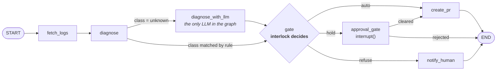

# LangGraph integration

A self-healing CI agent that asks interlock what it is allowed to do.

> **Honest scope.** [`graph.py`](graph.py) is a reference implementation. It
> needs `langgraph`, a GitHub token, and network access, so this repo's CI does
> not run it — it is syntax-checked, not executed. The interlock half of the
> loop is covered by 35 tests (`npm test`).
>
> The LangGraph API surface used here — `interrupt()`, `Command(resume=...)`,
> `add_conditional_edges` with explicit destinations, and the `SqliteSaver`
> constructor — was checked against the current LangGraph documentation rather
> than written from memory. APIs still move; if something has shifted, the docs
> win over this file.

## The shape



The interesting path is the one through `diagnose_with_llm`. When no rule
matches, an LLM writes the patch — and that patch **still goes through the
gate**. The model is one more proposer, not an authority. It cannot widen its own
scope, because scope is read off the diff it produced.

## What interlock does and what the graph does

| Job | Who |
| --- | --- |
| Fetch the log, open the PR, talk to Slack | the graph |
| Write a patch for a failure no rule covers | the LLM |
| Decide whether that patch is allowed | **interlock** |
| Remember that a person already said yes | **interlock** |
| Record the decision | **interlock** |

Keeping the last three out of the graph is the whole design. Policy in Python is
policy you cannot review without reading Python.

## Human-in-the-loop

`approval_gate` calls LangGraph's `interrupt()`. The graph suspends, the
checkpointer writes state to SQLite, and the process can exit. Nothing is held
in memory.

```bash
python graph.py --repo acme/api --run 4530
# held — resume with: python graph.py --resume acme/api:4530 --approve
```

Days later, from a different machine:

```bash
python graph.py --resume acme/api:4530 --approve --by "Manpreet Singh"
```

Two things persist across that pause, and they are different:

- **The LangGraph checkpoint** — where the graph was. Ephemeral working state.
- **The interlock ledger** — what was decided, by whom, under which rules.
  Committed to the repo, readable as plain JSON lines with no library at all.

Only the second one is still useful in six months when someone asks why a
workflow file changed.

## Running it

```bash
pip install -r requirements.txt
npm install -g interlock-ci      # or set INTERLOCK_BIN to bin/interlock.mjs

export GH_TOKEN=...
export SLACK_WEBHOOK_URL=...     # optional
export ANTHROPIC_API_KEY=...     # optional, only for unmatched failures

python graph.py --repo acme/api --run 4530
```

Environment:

| Variable | Default | Purpose |
| -------- | ------- | ------- |
| `INTERLOCK_BIN` | `interlock` | Path to the CLI. |
| `INTERLOCK_ROOT` | `.` | The checkout being patched. |
| `SLACK_WEBHOOK_URL` | — | Where held decisions go. Skipped if unset. |

## Test it on something you do not care about

Make a scratch repo. Add a workflow that runs a script importing a package you
never install. Let it fail a few times. Point the agent at those runs with the
policy in `shadow` mode and watch what it *would* have done.

Do not point this at a repository that matters until you have read a week of
`interlock log` output and agree with every line of it.
